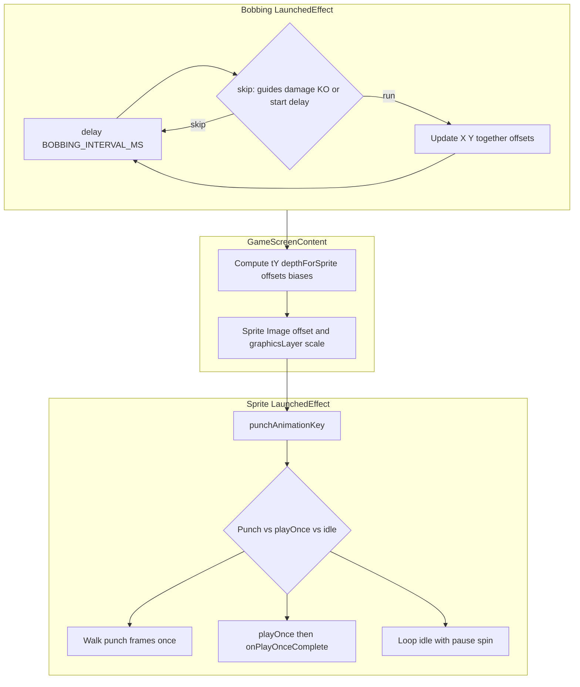

# Web port: Satoshi vs Lizard boxing parity

This document describes how the Android app drives **Satoshi** (hero) and **Lizard** (villain) boxing so a web client can match behavior. Source of truth: [`app/src/main/java/com/vv/btcpunchup/MainActivity.kt`](app/src/main/java/com/vv/btcpunchup/MainActivity.kt). Volume aggregation and UI throttle: [`app/src/main/java/com/vv/btcpunchup/data/WebSocketRepository.kt`](app/src/main/java/com/vv/btcpunchup/data/WebSocketRepository.kt).

**Planning artifacts in this repo:** There are no historical `plan.md` (or `*plan*`) files in the BTC_PunchUp tree. Product and mechanics context outside the Kotlin sources lives in this document, [`README.md`](README.md), and [`privacy.md`](privacy.md). For a web port, treat **`WEB_BOXING_PARITY.md` + `MainActivity.kt`** as the parity contract.

---

## 1. Hand and exchange mapping

- **Left hand** = **Binance**
- **Right hand** = **Coinbase**

Satoshi punch types come from **BUY** volume (per exchange, vs that exchange’s historical max buy). Lizard punch types come from **SELL** volume (same `getPunchTypeFromVolume` helper; different inputs).

---

## 2. Offense vs defense (ring sprites) — Binance-only gate

Ring logic uses **only Binance** sell vs buy to decide whether the hero is in “defense mode” for sprites:

```kotlin
val isBinanceDefense = (binanceSellVolume ?: 0.0) > (binanceBuyVolume ?: 0.0)
```

- **Satoshi defends** when `isBinanceDefense && ENABLE_DODGING` and the defense branch runs.
- **Satoshi punches** when not in that defense path (Binance buy ≥ sell), subject to KO / damage / punching flags.
- **Lizard defense mode** is `isLizardDefense = !isBinanceDefense` (not Coinbase’s own imbalance).

**UI note:** `isCoinbaseDefense` (Coinbase sell > buy) is computed and used for the **Coinbase overlay** “Offense/Defense” label only; it does **not** drive the sprite state machine.

---

## 3. Punch types (volume bands)

`getPunchTypeFromVolume(volume, maxVolume)` returns `null` if `volume == null`, `volume <= 0`, or `maxVolume <= 0`. Else `volumePercent = volume / maxVolume`:

| Volume % (inclusive) | Punch   |
|----------------------|---------|
| 1% – 20%             | Jab     |
| 21% – 40%            | Body    |
| 41% – 60%            | Hook    |
| 61% – 80%            | Cross   |
| 81% – 100%           | Uppercut|

Constants: `VOLUME_PERCENT_*` (see appendix).

---

## 4. Defense types (`getDefenseTypeFromVolume`)

Per-exchange ratio: `vol / maxVol` for each stream passed in. **Both** ratios must be valid (non-null volume, max > 0); otherwise the function returns `null`.

- **Head block:** `max(binancePct, coinbasePct)` in `[DEFENSE_HEAD_BLOCK_MIN, DEFENSE_HEAD_BLOCK_MAX]`
- **Body block:** `max(...)` in `[DEFENSE_BODY_BLOCK_MIN, DEFENSE_BODY_BLOCK_MAX]`
- **Dodge left:** Binance ratio in `[DEFENSE_DODGE_LEFT_MIN, DEFENSE_DODGE_LEFT_MAX]`
- **Dodge right:** Coinbase ratio in `[DEFENSE_DODGE_RIGHT_MIN, DEFENSE_DODGE_RIGHT_MAX]`

**Priority:** Head > Body > Dodge. If **both** dodges qualify → **`DODGE_LEFT`**.

**Which streams are passed:**

| Boxer   | When defense UI runs | First pair of args        | Max pair              |
|---------|----------------------|---------------------------|------------------------|
| Satoshi | `isBinanceDefense`   | Binance buy, Coinbase buy | max buy per exchange   |
| Lizard  | `isLizardDefense`    | Binance sell, Coinbase sell | max sell per exchange |

So the **same numeric thresholds** apply to buy-normalized ratios (Satoshi) or sell-normalized ratios (Lizard).

---

## 5. Required defense vs attack

| Attack              | Hand   | Required defense |
|---------------------|--------|------------------|
| Jab, Body           | Left   | Dodge Right      |
| Jab, Body           | Right  | Dodge Left       |
| Hook, Cross         | Either | Body block       |
| Uppercut            | Either | Head block       |

Hit check: `defender.isDefending && defender.currentDefenseType == requiredDefense` → no damage.

Wrong defense while `isDefending`: damage is **deferred** until the defense completion coroutine runs (`pending*DamageAfterDefense`).

---

## 6. Cooldowns and hand priority

- Punch cooldowns are **per punch type**, stored in `lastPunchTime` (Satoshi) and `lastLizardPunchTime` (Lizard).
- Defense type switch: if new type differs and previous type is still within its cooldown, keep **previous** effective type.
- **Both hands active:** `PUNCH_PRIORITY_HAND` (currently **RIGHT** = Coinbase wins).
- After defense animation completes, wait **`MIN_IDLE_AFTER_DEFENSE_MS`** before entering defense again.

---

## 7. Timing and hit detection

- **Per animation frame:** `ANIMATION_FRAME_DELAY_MS`
- **Exchange snapshot rate:** `EXCHANGE_EMIT_THROTTLE_MS` (how often flows update UI-driven punch/defense inputs)
- **Impact delay:** `(max(0, frameCount - 2)) * ANIMATION_FRAME_DELAY_MS` — hit on **second-to-last** frame timing
- **Punch completion delay:** `frameCount * ANIMATION_FRAME_DELAY_MS`
- **Defense completion delay:** `max(3 * ANIMATION_FRAME_DELAY_MS, frameCount * ANIMATION_FRAME_DELAY_MS)` — literal **`3`** min frames (not a named constant in Kotlin)
- **Damage safety timeout:** `DAMAGE_COMPLETION_SAFETY_TIMEOUT_MS` if `onPlayOnceComplete` never fires
- **KO:** wall-clock delays `KO_FALL_DISPLAY_MS` → `KO_KNOCKED_DOWN_DISPLAY_MS` → `KO_RISE_DISPLAY_MS`; then reset damage points and idle

---

## 8. Damage and KO

- Points: Jab `DAMAGE_POINTS_JAB` … Uppercut `DAMAGE_POINTS_UPPERCUT`; cap `MAX_DAMAGE_POINTS`.
- **Simultaneous KO window:** `SIMULTANEOUS_KO_WINDOW_MS` for `awardKO` scoring logic.

---

## 9. Feature flags and guards

- `ENABLE_DODGING` — defense animations; when false, defense cooldown state cleared on Satoshi path.
- `ENABLE_PUNCHING` — disables punch derivation for both fighters.
- `showCenterGuides` — forces punch types null; alignment UI.
- Non-null `satoshiKOPhase` / `lizardKOPhase` — pauses that boxer’s punch/defense updates; opponent goes idle.
- `satoshiInDamage` / `lizardInDamage` — blocks respective sprite updates and cancels pending impact if target in damage.

---

## 10. `ExchangeData.isDefenseMode` (spread-based)

[`WebSocketRepository.kt`](app/src/main/java/com/vv/btcpunchup/data/WebSocketRepository.kt) sets `isDefenseMode` from **bid/ask spread vs rolling median** (`SPREAD_*` constants). That field is **not** used in `MainActivity` for the boxing sprite gate; sprites use **Binance sell > buy** only. For ring parity, mirror `MainActivity`, not spread defense alone.

---

## 11. README vs code

| Topic | README | Code |
|--------|--------|------|
| Sprite offense/defense | Reads as per-exchange sell > buy | **Binance-only** `isBinanceDefense`; Lizard defense = `!isBinanceDefense` |
| Lizard defense inputs | Implies BUY % | **SELL %** into the same threshold function |
| Stale comments in source | — | Some comments still say 67%/34–66%/33%; **constants** are authoritative |

---

## 12. Boxer movement and animation gating

Movement is **orthogonal** to volume-driven punch/defense: a dedicated coroutine updates shared offsets; **`GameScreenContent`** composes position, bobbing, and depth; the **`Sprite`** composable advances frames according to punch, one-shot, or idle branches.

### 12.1 Bobbing and drift state (`PriceDisplayScreen`)

All of the following are advanced in one `LaunchedEffect(isVisible, satoshiInDamage, lizardInDamage, satoshiKOPhase, lizardKOPhase, showCenterGuides)` in [`MainActivity.kt`](app/src/main/java/com/vv/btcpunchup/MainActivity.kt) (approximately lines 1905–1962):

| State | Role |
|-------|------|
| `movementOffsetX`, `movementDirection` | Shared horizontal oscillation. **Satoshi** uses `+movementOffsetX`; **Lizard** uses **`-movementOffsetX`** (mirror). Each tick: `movementOffsetX += movementDirection * BOBBING_STEP_PX`; clamp to `[BOBBING_MAX_X_LEFT, BOBBING_MAX_X_RIGHT]`; flip direction at bounds. |
| `movementOffsetY`, `movementDirectionY` | Vertical bob **for both** (same sign). Y advances only on **every second horizontal centre cross**: on each X zero-cross, `applyYOnNextCentreCross` toggles; when it becomes `false` after a flip, **`BOBBING_Y_STEPS_PER_FULL_X_CYCLE`** vertical steps run in one iteration. Clamp to `[BOBBING_MAX_Y_UP, BOBBING_MAX_Y_DOWN]`. |
| `togetherOffsetX`, `togetherDirection` | **Pair** lateral drift: the **same** `+togetherOffsetX` is added to both fighters’ X. Each tick: `togetherOffsetX += togetherDirection * BOBBING_TOGETHER_STEP_PX`; clamp to `[BOBBING_TOGETHER_MAX_X_LEFT, BOBBING_TOGETHER_MAX_X_RIGHT]`. |

**Start gate:** `movementStartTimeMs` is set when the activity lifecycle reaches `STARTED`; the loop skips updates until **`BOBBING_START_DELAY_MS`** has elapsed since that timestamp.

### 12.2 When bobbing does not advance

Each loop iteration **continues** without mutating offsets when:

- `showCenterGuides` is true (boxer alignment / crosshair UI);
- `satoshiInDamage || lizardInDamage || satoshiKOPhase != null || lizardKOPhase != null` — damage or KO on **either** boxer freezes **shared** bobbing;
- elapsed time since visible is less than **`BOBBING_START_DELAY_MS`**.

Numeric constants: **Appendix A** (bobbing and depth tables). `movementStartTimeMs` is **remembered state**, not a file-level `const`.

### 12.3 Render-time composition (`GameScreenContent`)

Before `Sprite(...)` for each foreground sprite (approximately lines 3794–3838 in `MainActivity.kt`):

1. **`tY`** — Normalizes `movementOffsetY` from `[BOBBING_MAX_Y_UP, BOBBING_MAX_Y_DOWN]` to **0..1** (when `rangeY != 0f`).
2. **`depthForSprite`** — Per fighter, linear blend between “smaller when visually up” and “larger when down” using `SCALE_SMALLER_PERCENT_*` and `SCALE_LARGER_PERCENT_*`. Passed into `Sprite` as **`depthScaleMultiplier`**.
3. **`graphicsLayer` on the `Image`** — Sets `scaleX` and `scaleY` to **`depthScaleMultiplier`** with **`TransformOrigin.Center`** (depth bob is separate from `spriteData.sizeScale`, which sets layout `baseSizeDp`).
4. **Pixel offsets** — `xBobbingOffset`: Satoshi `movementOffsetX + togetherOffsetX`; Lizard `-movementOffsetX + togetherOffsetX`; Cat `0f` for horizontal bobbing. **Vertical:** `movementOffsetY` for boxers; cat uses `0f` for Y bobbing in this path.
5. **Center bias** — `effectiveSatoshiBiasPx` / `effectiveLizardBiasPx` (saved preferences when guides off; live alignment drag values when `showCenterGuides`).
6. **`animationsPaused = showCenterGuides`** — Passed into `Sprite` so frame stepping **stalls** in alignment mode (busy-wait `delay(100)` while paused).
7. **`opponentInKO`** — Passed into `Sprite`; included in **`punchAnimationKey`** for the idle branch so the idle coroutine **re-keys** when the opponent exits KO (fixes frozen idle after a KO).

### 12.4 `Sprite` composable — layout

- **`baseSizeDp`** = `spriteData.spriteSizeDp.dp * spriteData.sizeScale`.
- **Screen position:** `spriteData.spriteState.position` (center) plus `xBobbingOffset`, `yBobbingOffset`, optional **`centerBiasPxOverride`**, minus half **`baseSizeDp`** in pixels so the bitmap is centered on the anchor.

### 12.5 Animation branches (frame `LaunchedEffect`)

`punchAnimationKey` is derived with `remember` from `currentPunchType`, `currentHandSide`, `currentDefenseType`, `playAnimationOnce`, and **`opponentInKO`**. For the generic idle key tail, the code uses `animationFrames.hashCode()`, `playAnimationOnce`, and `oppKO=$opponentInKO`.

`LaunchedEffect(punchAnimationKey, animationsPaused)` resolves in **priority order**:

| Priority | Condition | Behavior |
|----------|-----------|----------|
| 1 | `spriteData.isAnimated && frames non-empty && isPunching && currentPunchType != null` | Sequential indices **once**; `ANIMATION_FRAME_DELAY_MS` per step; each step waits `while (animationsPaused) { delay(100) }`. |
| 2 | `playAnimationOnce` | Defense, damage, or KO lists: play indices **once** with the same delay and pause spin; then invoke **`onPlayOnceComplete(spriteData.spriteType)`**. |
| 3 | else | **Idle loop:** set frame 0, then `while (true)` advance `(currentFrameIndex + 1) % frames.size`; if `animationsPaused`, `delay(100)` and **continue** (frame held). |

**`LaunchedEffect(spriteData.animationFrames)`** — When the **frames list** changes, set `currentResourceId = frames[0]` and `currentFrameIndex = 0` so the drawable matches the new sequence immediately.

### 12.6 Cross-links to boxing state

- **Idle** — `SATOSHI_IDLE_FRAMES` / `LIZARD_IDLE_FRAMES`; branch 3 when not punching and not `playAnimationOnce`.
- **Punch / defense** — Parent coroutines mutate `SpriteData` on the shared `sprites` list; **`Sprite` does not read exchange volumes**.
- **KO** — `GameScreenContent` wraps `onPlayOnceComplete`: if `spriteType == SATOSHI && satoshiKOPhase != null` (or Lizard analog), **return** without calling the outer handler so KO-phase sprites are not cleared as if they were short damage clips.

### 12.7 Overview diagram



---

## Appendix A — Constants in `MainActivity.kt` (boxing-relevant)

Feature flags and logs:

| Name | Value |
|------|--------|
| `ENABLE_EXCHANGE_LOGS` | `false` |
| `ENABLE_PUNCH_LOGS` | `false` |
| `ENABLE_BLOCKING_LOGS` | `false` |
| `ENABLE_LIZARD_LOGS` | `false` |
| `ENABLE_DODGING` | `true` |
| `ENABLE_PUNCHING` | `true` |
| `DAMAGE_DEBUG` | `false` |

Boxer layout / rendering (same screen as fight):

| Name | Value |
|------|--------|
| `SATOSHI_SCALE` | `3.5f` |
| `SATOSHI_Y_POSITION` | `0.70f` |
| `SATOSHI_X_POSITION` | `0.5f` |
| `LIZARD_SCALE` | `5f` |
| `LIZARD_Y_POSITION` | `0.66f` |
| `LIZARD_X_POSITION` | `0.5f` |
| `SATOSHI_CENTER_BIAS_DP` | `20f` |
| `LIZARD_CENTER_BIAS_DP` | `115f` |
| `SATOSHI_CROSSHAIR_X_OFFSET_DP` | `-20f` |
| `LIZARD_CROSSHAIR_X_OFFSET_DP` | `-115f` |

Bobbing / shared drift (boxers during gameplay):

| Name | Value |
|------|--------|
| `BOBBING_MAX_X_LEFT` | `-20f` |
| `BOBBING_MAX_X_RIGHT` | `20f` |
| `BOBBING_MAX_Y_UP` | `-15f` |
| `BOBBING_MAX_Y_DOWN` | `15f` |
| `BOBBING_STEP_PX` | `1f` |
| `BOBBING_INTERVAL_MS` | `40L` |
| `BOBBING_Y_STEPS_PER_FULL_X_CYCLE` | `3` |
| `BOBBING_TOGETHER_MAX_X_LEFT` | `-200f` |
| `BOBBING_TOGETHER_MAX_X_RIGHT` | `200f` |
| `BOBBING_TOGETHER_STEP_PX` | `5f` |
| `BOBBING_START_DELAY_MS` | `150L` |

Depth scale (sprite size vs vertical position):

| Name | Value |
|------|--------|
| `SCALE_SMALLER_PERCENT_SATOSHI` | `5f` |
| `SCALE_LARGER_PERCENT_SATOSHI` | `20f` |
| `SCALE_SMALLER_PERCENT_LIZARD` | `5f` |
| `SCALE_LARGER_PERCENT_LIZARD` | `20f` |

Spread model (repository / `ExchangeData`; not sprite gate):

| Name | Value |
|------|--------|
| `SPREAD_MEDIAN_WINDOW_SECONDS` | `10L` |
| `SPREAD_DEFENSE_MULTIPLIER` | `0.25f` |
| `SPREAD_DEFENSE_MIN_PERCENT` | `0.001f` |

Animation and exchange throttle:

| Name | Value |
|------|--------|
| `ANIMATION_FRAME_DELAY_MS` | `80L` |
| `EXCHANGE_EMIT_THROTTLE_MS` | `100L` |

Damage / KO:

| Name | Value |
|------|--------|
| `DAMAGE_COMPLETION_SAFETY_TIMEOUT_MS` | `3000L` |
| `KO_FALL_DISPLAY_MS` | `400L` |
| `KO_KNOCKED_DOWN_DISPLAY_MS` | `5000L` |
| `KO_RISE_DISPLAY_MS` | `4600L` |
| `SIMULTANEOUS_KO_WINDOW_MS` | `150L` |
| `DAMAGE_POINTS_JAB` | `1` |
| `DAMAGE_POINTS_BODY` | `3` |
| `DAMAGE_POINTS_HOOK` | `4` |
| `DAMAGE_POINTS_CROSS` | `5` |
| `DAMAGE_POINTS_UPPERCUT` | `8` |
| `MAX_DAMAGE_POINTS` | `100` |

Overlay / block height (shown with fight UI):

| Name | Value |
|------|--------|
| `BLOCK_HEIGHT_REFRESH_INTERVAL_MS` | `60_000L` |
| `BLOCK_HEIGHT_FLASH_HALF_MS` | `40L` |
| `TIMER_FLASH_WHEN_ELAPSED_MS` | `600_000L` |
| `TIMER_FLASH_INTERVAL_MS` | `30_000L` |

Punch volume bands (fraction of 0–1):

| Name | Value |
|------|--------|
| `VOLUME_PERCENT_JAB_MIN` | `0.01f` |
| `VOLUME_PERCENT_JAB_MAX` | `0.20f` |
| `VOLUME_PERCENT_BODY_MIN` | `0.21f` |
| `VOLUME_PERCENT_BODY_MAX` | `0.40f` |
| `VOLUME_PERCENT_HOOK_MIN` | `0.41f` |
| `VOLUME_PERCENT_HOOK_MAX` | `0.60f` |
| `VOLUME_PERCENT_CROSS_MIN` | `0.61f` |
| `VOLUME_PERCENT_CROSS_MAX` | `0.80f` |
| `VOLUME_PERCENT_UPPERCUT_MIN` | `0.81f` |
| `VOLUME_PERCENT_UPPERCUT_MAX` | `1.00f` |

Defense volume bands (same numeric gates for buy-% or sell-% depending on caller):

| Name | Value |
|------|--------|
| `DEFENSE_HEAD_BLOCK_MIN` | `0.57f` |
| `DEFENSE_HEAD_BLOCK_MAX` | `1.00f` |
| `DEFENSE_BODY_BLOCK_MIN` | `0.24f` |
| `DEFENSE_BODY_BLOCK_MAX` | `0.56f` |
| `DEFENSE_DODGE_LEFT_MIN` | `0.01f` |
| `DEFENSE_DODGE_LEFT_MAX` | `0.23f` |
| `DEFENSE_DODGE_RIGHT_MIN` | `0.01f` |
| `DEFENSE_DODGE_RIGHT_MAX` | `0.23f` |

Defense switch cooldowns:

| Name | Value |
|------|--------|
| `DEFENSE_HEAD_BLOCK_COOLDOWN_MS` | `1000L` |
| `DEFENSE_BODY_BLOCK_COOLDOWN_MS` | `1000L` |
| `DEFENSE_DODGE_LEFT_COOLDOWN_MS` | `1000L` |
| `DEFENSE_DODGE_RIGHT_COOLDOWN_MS` | `1000L` |
| `MIN_IDLE_AFTER_DEFENSE_MS` | `100L` |

Punch priority and punch cooldowns:

| Name | Value |
|------|--------|
| `PUNCH_PRIORITY_HAND` | `HandSide.RIGHT` (Kotlin `val`) |
| `PUNCH_COOLDOWN_JAB_MS` | `1000L` |
| `PUNCH_COOLDOWN_BODY_MS` | `2000L` |
| `PUNCH_COOLDOWN_HOOK_MS` | `3000L` |
| `PUNCH_COOLDOWN_CROSS_MS` | `4000L` |
| `PUNCH_COOLDOWN_UPPERCUT_MS` | `5000L` |

Derived (not a `const`, but used in logic):

| Expression | Value |
|------------|--------|
| `IDLE_LOOP_DURATION_MS` | `SATOSHI_IDLE_FRAMES.size * ANIMATION_FRAME_DELAY_MS` → **480** ms with 6 idle frames |

---

## Appendix B — `WebSocketRepository.kt` (boxing data path)

| Name | Value | Role |
|------|--------|------|
| `EXCHANGE_EMIT_THROTTLE_MS` | Imported from `MainActivity`; **`100L`** | Delay between `_binanceData` / `_coinbaseData` snapshot emissions |
| `volumeResetInterval` | **`5000L`** (private) | Period after which buy/sell accumulators reset |

---

## Appendix C — Literals in boxing logic (not top-level `const`)

| Location | Literal | Meaning |
|----------|---------|---------|
| Satoshi + Lizard defense completion | **`3`** | Minimum frame count for defense duration: `max(3 * ANIMATION_FRAME_DELAY_MS, frameCount * ANIMATION_FRAME_DELAY_MS)` |
| Impact scheduling | **`2`** in `frameCount - 2` | Hit evaluation aligned with second-to-last frame index |

---

## Appendix D — `SpriteData` defaults (boxing sprites)

From `data class SpriteData` in `MainActivity.kt`:

| Field | Default |
|-------|---------|
| `layer` | `2` (fg2 Satoshi; Lizard uses fg1 where configured) |
| `spriteSizeDp` | `64f` |
| `sizeScale` | `1.0f` (overridden to `SATOSHI_SCALE` / `LIZARD_SCALE` in updates) |

---

## Appendix E — Frame list lengths (sprite assets)

Punch and defense animations drive `frameCount` for impact and duration. Current drawable lists in code:

| Category | Frame counts (per sequence) |
|----------|------------------------------|
| Satoshi idle | **6** |
| Lizard idle | **6** |
| Satoshi / Lizard jab, body, head block, body block, dodges (per side where applicable) | **3** |
| Satoshi left hook | **3** |
| Satoshi right hook | **3** |
| Lizard left hook | **4** |
| Lizard right hook | **4** |
| Satoshi left/right cross | **3** |
| Lizard left/right cross | **3** |
| Satoshi left/right uppercut | **4** |
| Lizard left/right uppercut | **4** |
| Satoshi left/right damage head | **3** |
| Satoshi center uppercut damage | **4** |
| Satoshi left/right damage body | **3** |
| Lizard small head (jab) damage | **3** |
| Lizard head/body damage (non-jab) | **3** |
| Lizard center uppercut damage | **4** |
| KO Fall / Knocked Down / Rise (each boxer) | **1** per phase |

If the web port swaps asset frame counts, recompute impact delay and completion delays from **`frameCount`** above.
